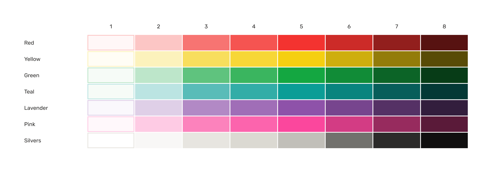

# Sargam Colors
A simple scalable color system for designing warm welcoming, caring websites and apps.

[[sargamcolors.com]](https://sargamcolors.com/) 

## Installation
Install Sargam Colors from your terminal via npm. Current version is 2.1.1

```
npm i @sargamdesign/colors
```

Import vanilla CSS

```
import "@sargamdesign/colors/dist/themes/light.css";
import "@sargamdesign/colors/dist/themes/dark.css";
```

To get started quickly, you can use the CDN files.

```
<link rel="stylesheet" href="https://cdn.jsdelivr.net/npm/@sargamdesign/colors@2.1.1/dist/themes/light.css" />
```

```
<link rel="stylesheet" href="https://cdn.jsdelivr.net/npm/@sargamdesign/colors@2.1.1/dist/themes/dark.css" />
```

[[Figma variables & styles]](https://www.figma.com/community/file/1315655575821378223/sargam-colors)

## Usage Example

```
.button { background-color: var(--button-primary);
          color: var(--text-on-color); }
.button:hover { background-color: var(--button-primary-hover); }
.button:active { background-color: var(--button-primary-active); }
```

## Understanding Project Structure
Here's the file structure of a Sargam colors:

```
.
├── tokens/
│   ├── global/
│   │   └── global.json
│   └── themes/
│       ├── dark/
│       │   └── dark.json
│       └── light/
│           └── light.json
└── dist/
    └── themes/
        ├── light.css
        └── dark.css
```

`tokens/` folder serves as the single source of truth (SSOT), residing within the GitHub repository and synchronized with Figma's color styles or variables. (To maintain a tech-agnostic approach, Sargam Colors employs the JSON format for the SSOT.)

For generating various web or app-specific requirements, [Style Dictionary](https://github.com/amzn/style-dictionary) will be utilized.

To modify colors values or to add new sequential scales, go to `tokens/global/`. If you want to modify the current theme or create a new one, head to the `tokens/themes/`. For modifying generated CSS variables, leverage SASS functions and mixins.


## Building Themes
```
git clone https://github.com/SargamDesign/sargam-colors.git
cd sargam-colors
npm i
npm run build
```

---

## Color Tokens

### Text
Variable | Value(Light) | Value(Dark)| Role
:--- |:--- |:--- |:---
`--text-primary` | *--silver8* | *--silver1* | Body copy
`--text-primary-alt` | *--silver7* | *--silver3* | Body copy alt
`--text-secondary` | *--silver6* | *--silver5* | Secondary text color
`--text-placeholder` | *--silver5* | *--silver6* | Placeholder text
`--text-on-color` | *--silver1* | *--silver1* | Text on interactive colors
`--text-error` | *--red6* | *--red4* | Error message text
`--text-success` | *--green6* | *--green4* | Success message text

### Support
Variable | Value(Light) | Value(Dark)| Role
:--- |:--- |:--- |:---
`--support-error` | *--red5* | *--red4* | Error
`--support-warning` | *--yellow5* | *--yellow4* | Warning
`--support-success` | *--green5* | *--green4* | Success
`--support-info` | *--teal5* | *--teal4* | Information


### Link
Variable | Value(Light) | Value(Dark)| Role
:--- |:--- |:--- |:---
`--link` | *--teal6* | *--teal4* | Primary links
`--link-hover` | *--teal7* | *--teal6* | Hover state for primary links
`--link-subtle` | *--teal5* | *--teal5* | Secondary links
`--link-visited` | *--lavender6* | *--lavender4* | Link visited
`--link-muted` | *--silver8* | *--silver1* | Link muted


### Icon
Variable | Value(Light) | Value(Dark)| Role
:--- |:--- |:--- |:---
`--icon-primary` | *--silver7* | *--silver3* | Primary icons
`--icon-secondary` | *--silver6* | *--silver5* | Secondary icons
`--icon-disabled` | *--silver5* | *--silver6* | Disabled state for icons
`--icon-on-color` | *--silver1* | *--silver8* | Icons on interactive colors

### Button
Variable | Value(Light) | Value(Dark)| Role
:--- |:--- |:--- |:---
`--button-primary` | *--teal5* | *--teal4* | Primary button background
`--button-primary-hover` | *--teal6* | *--teal3* | Primary button hover
`--button-primary-active` | *--teal7* | *--teal2* | Primary button active
`--button-secondary` | *--silver8* | *--silver6* | Secondary button background
`--button-secondary-hover` | *--silver7* | *--silver7* | Secondary button hover
`--button-secondary-active` | *--silver6* | *--silver8* | Secondary button active
`--button-danger` | *--red5* | *--red4* | Danger button background
`--button-danger-hover` | *--red6* | *--red3* | Danger button hover
`--button-danger-active` | *--red7* | *--red2* | Danger button active
`--button-disabled` | *--silver5* | *--silver6* | Disabled button
`--button-disabled-alt` | *--silver4* | *--silver7* | Disabled button alt


### Border
Variable | Value(Light) | Value(Dark)| Role
:--- |:--- |:--- |:---
`--border-muted` | *--silver3* | *--silver7* | Muted borders and separators
`--border-default` | *--silver5* | *--silver6* | Default borders and separators
`--border-strong` | *--silver6* | *--silver5* | Strong borders and separators


### Background
Variable | Value(Light) | Value(Dark)| Role
:--- |:--- |:--- |:---
`--background` | *--silver1* | *--silver8* | Default app background
`--background-subtle` | *--silver2* | *--silver7* | Subtle background
`--background-selected` | *--silver3* | *--silver6* | Hovered UI element background
`--background-red` | *--red1* | *--red8* | Subtle red background
`--background-yellow` | *--yellow1* | *--yellow8* | Subtle yellow background
`--background-green` | *--green1* | *--green8* | Subtle green background
`--background-teal` | *--teal1* | *--teal8* | Subtle teal background
`--background-lavender` | *--lavender1* | *--lavender8* | Subtle lavender background
`--background-pink` | *--pink1* | *--pink8* | Subtle pink background

---

## Primitives

### Red
Variable | Value | Color
:--- |:--- |:---
`$red1` | hsl(0, 100%, 98%) | 
`$red2` | hsl(1, 90%, 88%) | 
`$red3` | hsl(1, 89%, 71%) | 
`$red4` | hsl(1, 89%, 64%) | 
`$red5` | hsl(1, 89%, 57%) | 
`$red6` | hsl(1, 67%, 48%) | 
`$red7` | hsl(1, 67%, 34%) | 
`$red8` | hsl(1, 67%, 20%) | 

### Yellow
Variable | Value | Color
:--- |:--- |:---
`$yellow1` | hsl(48, 100%, 98%) | 
`$yellow2` | hsl(51, 91%, 86%) | 
`$yellow3` | hsl(50, 92%, 67%) | 
`$yellow4` | hsl(50, 92%, 59%) | 
`$yellow5` | hsl(50, 92%, 51%) | 
`$yellow6` | hsl(50, 87%, 43%) | 
`$yellow7` | hsl(50, 87%, 31%) | 
`$yellow8` | hsl(50, 87%, 18%) | 

### Green
Variable | Value | Color
:--- |:--- |:---
`$green1` | hsl(132, 38%, 97%) |  
`$green2` | hsl(139, 45%, 82%) | 
`$green3` | hsl(139, 45%, 57%) | 
`$green4` | hsl(138, 51%, 47%) | 
`$green5` | hsl(138, 79%, 37%) | 
`$green6` | hsl(139, 78%, 31%) | 
`$green7` | hsl(138, 79%, 22%) | 
`$green8` | hsl(138, 79%, 13%) | 

### Teal
Variable | Value | Color
:--- |:--- |:---
`$teal1` | hsl(132, 38%, 97%) | 
`$teal2` | hsl(177, 43%, 81%) | 
`$teal3` | hsl(178, 42%, 54%) | 
`$teal4` | hsl(177, 55%, 44%) | 
`$teal5` | hsl(177, 87%, 33%) | 
`$teal6` | hsl(177, 87%, 28%) | 
`$teal7` | hsl(177, 86%, 20%) | 
`$teal8` | hsl(177, 87%, 12%) | 

### Lavender
Variable | Value | Color
:--- |:--- |:---
`$lavender1` | hsl(270, 40%, 98%) | 
`$lavender2` | hsl(280, 33%, 86%) | 
`$lavender3` | hsl(281, 34%, 65%) | 
`$lavender4` | hsl(281, 34%, 57%) | 
`$lavender5` | hsl(281, 35%, 49%) | 
`$lavender6` | hsl(281, 35%, 41%) | 
`$lavender7` | hsl(282, 35%, 29%) | 
`$lavender8` | hsl(281, 34%, 18%) | 

### Pink
Variable | Value | Color
:--- |:--- |:---
`$pink1` | hsl(334, 100%, 99%) | 
`$pink2` | hsl(331, 96%, 90%) | 
`$pink3` | hsl(331, 95%, 75%) | 
`$pink4` | hsl(331, 96%, 69%) | 
`$pink5` | hsl(331, 96%, 63%) | 
`$pink6` | hsl(331, 63%, 53%) | 
`$pink7` | hsl(332, 56%, 38%) | 
`$pink8` | hsl(331, 55%, 23%) | 

### Silver
Variable | Value | Color
:--- |:--- |:---
`$silver1` | hsl(0, 0%, 100%) | 
`$silver2` | hsl(30, 12%, 97%) | 
`$silver3` | hsl(43, 13%, 89%) | 
`$silver4` | hsl(47, 11%, 84%) | 
`$silver5` | hsl(45, 6%, 74%) | 
`$silver6` | hsl(48, 2%, 44%) | 
`$silver7` | hsl(30, 2%, 17%) | 
`$silver8` | hsl(0, 3%, 6%) | 

## Websites and apps crafted with Sargam Colors:
- [Sargam Icons](https://sargamicons.com/)
- [Sargam Design](https://sargam.design/)
- [Your Vedas](https://yourvedas.com/)
- [Andlo](https://www.andlopayroll.com/)

## License
MIT License, Copyright (c) 2023 Abhimanyu Rana.
Brought to you by [@planetabhi](https://twitter.com/planetabhi) 🙌 


[](https://badge.fury.io/js/@sargamdesign%2Fcolors) 
[](https://www.jsdelivr.com/package/npm/@sargamdesign/colors)
